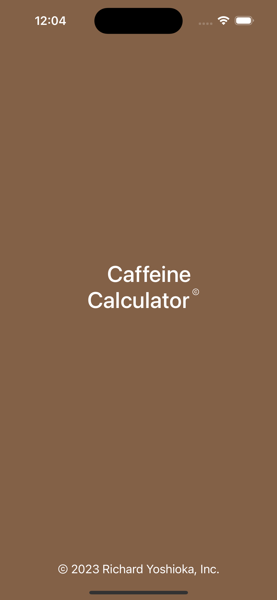
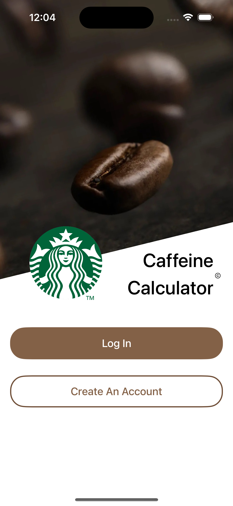
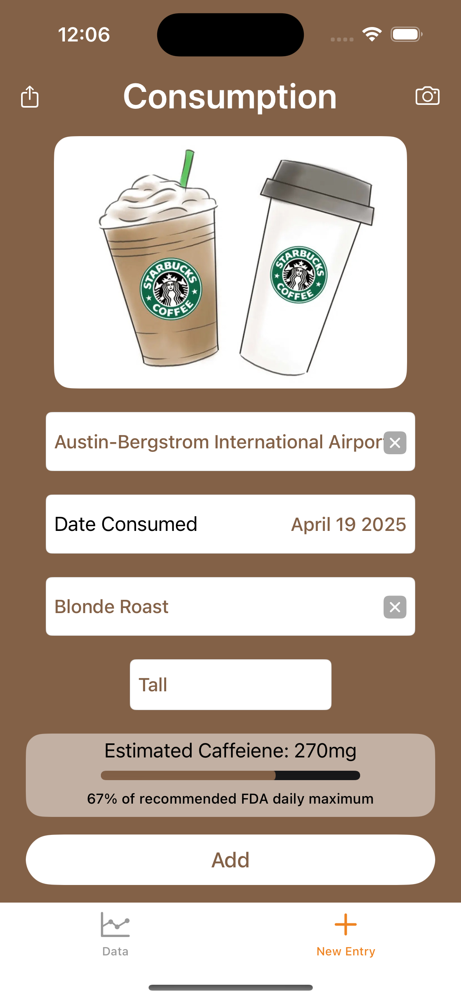

# ☕ Caffeine Calculator

A mobile app designed to help users monitor and manage their daily caffeine intake. The app tracks consumption, estimates caffeine levels in the body over time, and visualizes trends through interactive graphs.

https://github.com/user-attachments/assets/69ceaef2-0143-4474-8f79-5a64eb2775ff

---

## 📱 Features

- **Caffeine Intake Tracking** – Log drinks and caffeine amounts throughout the day  
- **Metabolism-Based Calculations** – Estimate current caffeine levels in your body over time  
- **Graphical Insights** – Visualize your caffeine data with dynamic charts  
- **Local Storage** – Save and retrieve data using Core Data for persistent tracking  

---

## 🛠️ Built With

- **Swift** – Core app logic and data handling  
- **SwiftUI** – Modern, declarative UI design  
- **UIKit** – Integrated for custom components and fine UI control  
- **Core Data** – Local data persistence for user inputs and calculated values  

---

## 🎓 About the Project

This project was developed as part of a class assignment to explore mobile app development with Swift and iOS frameworks. It focuses on practical skills like data modeling, user interface design, and local storage implementation.

---

## 🚀 Future Improvements

- Notifications/reminders for caffeine intake limits  
- More drink presets and caffeine sources  
- Dark mode and theme customization  
- Export/share caffeine logs

---

## 📸 Screenshots

\

\

---

## 📦 Installation

To run the project locally:

1. Clone the repository
2. Open in **Xcode**
3. Build and run on a simulator or physical device

---
